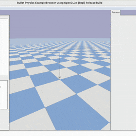

> [!TIP]
> For research work with **symbolic dynamics and constraints**, also try [`safe-control-gym`](https://github.com/learnsyslab/safe-control-gym)
>
> For GPU-accelerated, **differentiable, JAX-based simulation**, also try [`crazyflow`](https://github.com/learnsyslab/crazyflow)
>
> For production-grade deployment of **ROS2 + PX4/ArduPilot + YOLO/LiDAR**, use [`aerial-autonomy-stack`](https://github.com/JacopoPan/aerial-autonomy-stack)

# gym-pybullet-drones

This is a minimalist refactoring of the original `gym-pybullet-drones` repository, designed for compatibility with [`gymnasium`](https://github.com/Farama-Foundation/Gymnasium), [`stable-baselines3` 2.0](https://github.com/DLR-RM/stable-baselines3/pull/1327), and [`betaflight`](https://github.com/betaflight/betaflight)/[`crazyflie-firmware`](https://github.com/bitcraze/crazyflie-firmware/) SITL.

> **NEWS**: `gym-pybullet-drones` was featured in [GitHub's Maintainer Spotlight 2026](https://maintainermonth.github.com/academia/gym-pybullet-drones-maintainer-spotlight)

> **NOTE**: if you want to access the original codebase, presented at IROS in 2021, please `git checkout [paper|master]`

 

## Installation

Tested on Intel x64/Ubuntu 22.04 and Apple Silicon/macOS 26.2.

```sh
git clone https://github.com/learnsyslab/gym-pybullet-drones.git
cd gym-pybullet-drones/

conda create -n drones python=3.10
conda activate drones

pip3 install -e . # if needed, `sudo apt install build-essential` to install `gcc` and build `pybullet`

# check installed packages with `conda list`, deactivate with `conda deactivate`, remove with `conda remove -n drones --all`
```

## Use

### PID control examples

```sh
cd gym_pybullet_drones/examples/
python3 pid.py # position and velocity reference
python3 pid_velocity.py # desired velocity reference
```

### Downwash effect example

```sh
cd gym_pybullet_drones/examples/
python3 downwash.py
```

### Reinforcement learning examples (SB3's PPO)

```sh
cd gym_pybullet_drones/examples/
python learn.py # task: single drone hover at z == 1.0
python learn.py --multiagent true # task: 2-drone hover at z == 1.2 and 0.7

LATEST_MODEL=$(ls -t results | head -n 1) && python play.py --model_path "results/${LATEST_MODEL}/best_model.zip" # play and visualize the most recent learned policy after training
```

 

### Run all tests

```sh
# from the repo's top folder
cd gym-pybullet-drones/
pytest tests/
```

### Betaflight SITL example (Ubuntu only)

```sh
git clone https://github.com/betaflight/betaflight 
cd betaflight/
git checkout cafe727 # `master` branch head at the time of writing (future release 4.5)
make arm_sdk_install # if needed, `apt install curl``
make TARGET=SITL # comment out line: https://github.com/betaflight/betaflight/blob/master/src/main/main.c#L52
cp ~/gym-pybullet-drones/gym_pybullet_drones/assets/eeprom.bin ~/betaflight/ # assuming both gym-pybullet-drones/ and betaflight/ were cloned in ~/
betaflight/obj/main/betaflight_SITL.elf
```

In another terminal, run the example

```sh
conda activate drones
cd gym_pybullet_drones/examples/
python3 beta.py --num_drones 1 # check the steps in the file's docstrings to use multiple drones
```

### `pycffirmware` Python Bindings example (multiplatform, single-drone)

First, install [`pycffirmware`](https://github.com/learnsyslab/pycffirmware?tab=readme-ov-file#installation) for Ubuntu, macOS, or Windows, then

```sh
cd gym_pybullet_drones/examples/
python3 cf.py
```

## Citation

If you wish, please cite our [IROS 2021 paper](https://arxiv.org/abs/2103.02142) ([and original codebase](https://github.com/learnsyslab/gym-pybullet-drones/tree/paper)) as

```bibtex
@INPROCEEDINGS{panerati2021learning,
      title={Learning to Fly---a Gym Environment with PyBullet Physics for Reinforcement Learning of Multi-agent Quadcopter Control}, 
      author={Jacopo Panerati and Hehui Zheng and SiQi Zhou and James Xu and Amanda Prorok and Angela P. Schoellig},
      booktitle={2021 IEEE/RSJ International Conference on Intelligent Robots and Systems (IROS)},
      year={2021},
      volume={},
      number={},
      pages={7512-7519},
      doi={10.1109/IROS51168.2021.9635857}
}
```

## References

- Erwin Coumans and Yunfei Bai (2023) [*PyBullet Quickstart Guide*](https://docs.google.com/document/d/10sXEhzFRSnvFcl3XxNGhnD4N2SedqwdAvK3dsihxVUA/edit?tab=t.0#heading=h.2ye70wns7io3)
- Carlos Luis and Jeroome Le Ny (2016) [*Design of a Trajectory Tracking Controller for a Nanoquadcopter*](https://arxiv.org/pdf/1608.05786.pdf)
- Nathan Michael, Daniel Mellinger, Quentin Lindsey, Vijay Kumar (2010) [*The GRASP Multiple Micro-UAV Testbed*](https://ieeexplore.ieee.org/document/5569026)
- Benoit Landry (2014) [*Planning and Control for Quadrotor Flight through Cluttered Environments*](http://groups.csail.mit.edu/robotics-center/public_papers/Landry15)
- Julian Forster (2015) [*System Identification of the Crazyflie 2.0 Nano Quadrocopter*](https://www.research-collection.ethz.ch/handle/20.500.11850/214143)
- Antonin Raffin, Ashley Hill, Maximilian Ernestus, Adam Gleave, Anssi Kanervisto, and Noah Dormann (2019) [*Stable Baselines3*](https://github.com/DLR-RM/stable-baselines3)
- Guanya Shi, Xichen Shi, Michael O’Connell, Rose Yu, Kamyar Azizzadenesheli, Animashree Anandkumar, Yisong Yue, and Soon-Jo Chung (2019)
[*Neural Lander: Stable Drone Landing Control Using Learned Dynamics*](https://arxiv.org/pdf/1811.08027.pdf)
- C. Karen Liu and Dan Negrut (2020) [*The Role of Physics-Based Simulators in Robotics*](https://www.annualreviews.org/doi/pdf/10.1146/annurev-control-072220-093055)
- Yunlong Song, Selim Naji, Elia Kaufmann, Antonio Loquercio, and Davide Scaramuzza (2020) [*Flightmare: A Flexible Quadrotor Simulator*](https://arxiv.org/pdf/2009.00563.pdf)

-----
> UTIAS / [Learning Systems and Robotics Lab](https://github.com/learnsyslab) / [Vector Institute](https://github.com/VectorInstitute) / University of Cambridge's [Prorok Lab](https://github.com/proroklab)

<!--
## WIP/Desired Contributions/PRs

- [ ] Multi-drone `crazyflie-firmware` SITL support
- [ ] Use SITL services with steppable simulation
- [ ] Add motor delay, advanced ESC modeling by implementing a buffer in `BaseAviary._dynamics()`
- [ ] Replace `rpy` with quaternions (and `ang_vel` with body rates) by editing `BaseAviary._updateAndStoreKinematicInformation()`, `BaseAviary._getDroneStateVector()`, and the `.computeObs()` methods of relevant subclasses

## Troubleshooting

- On Ubuntu, with an NVIDIA card, if you receive a "Failed to create and OpenGL context" message, launch `nvidia-settings` and under "PRIME Profiles" select "NVIDIA (Performance Mode)", reboot and try again.
-->
#/

정리
Miniconda 설치 (~/miniconda3), conda init zsh로 셸 연동
drones conda 환경 생성 (Python 3.10)
pip3 install -e . 중 pybullet 소스 빌드가 최신 macOS SDK와 충돌 → conda-forge의 pybullet(3.2.5)로는 버전 요구사항(>=3.2.7) 미충족 → 소스를 패치(zutil.h의 낡은 fdopen 매크로 가드 수정)해서 pybullet 3.2.7 wheel을 직접 빌드/설치
최신 setuptools(83.0.0)가 pkg_resources를 제거해 임포트 실패 → setuptools<81로 고정해 해결
HoverAviary 환경 생성/리셋 테스트 성공
이제 사용법
새 터미널을 열거나 source ~/.zshrc 후:


conda activate drones
cd /Users/hanjakp/drone_simulation/gym_pybullet_drones/gym_pybullet_drones/examples

python3 pid.py            # PID 제어 예제
python3 downwash.py       # downwash 효과 예제
python learn.py           # 강화학습(PPO) 학습 예제
gui=True(기본값)로 실행하면 PyBullet GUI 창이 뜨는 예제들이니, 로컬 터미널(원격 SSH 아님)에서 실행하시면 됩니다.

도형 경로 오프라인-RL 데이터셋 (shape_dataset.py)
드론이 랜덤한 삼각형/사각형/오각형/원 경로를 그리며 (state, action) 데이터를 CSV로 저장하는 스크립트.

conda activate drones
cd /Users/hanjakp/drone_simulation/gym_pybullet_drones/gym_pybullet_drones/examples

# 에피소드 하나 실행 (GUI로 실시간 비행 확인, --seed로 재현 가능)
python shape_dataset.py --shape triangle --seed 0

# 실행 후 그래프도 같이 보고 싶으면
python shape_dataset.py --shape triangle --seed 0 --plot True       # 위치/속도/자세 시간축 그래프 (Logger)
python shape_dataset.py --shape triangle --seed 0 --plot_path True  # 목표 경로 vs 실제 비행 경로 3D 비교 그래프

# 이미 모은 CSV를 다시 보고 싶을 때: 파일명(예: triangle-seed0-...csv)의 shape/seed만 그대로 넣으면
# 같은 경로/기울기/배치가 재생성됨 (CSV를 직접 열 필요 없음)
python shape_dataset.py --shape square --seed 3 --plot_path True

# 스텝 수 목표치까지 여러 에피소드를 도형 돌아가며 자동 수집 (CSV는 --output_folder/shape_dataset/ 안에 하나씩 저장)
python collect_shape_dataset.py --target_steps 1000000 --output_folder dataset_1M

# 에피소드마다 최고 속도/가속도를 범위 안에서 랜덤으로 뽑고 싶을 때 (기본은 min==max=2.0 고정, 안 건드리면 이전과 동일)
# CSV의 max_speed/max_accel 컬럼에 그 에피소드에 실제로 쓰인 값이 남음
python shape_dataset.py --shape circle --max_speed_min 1.0 --max_speed_max 3.0 --max_accel_min 1.0 --max_accel_max 3.0
python collect_shape_dataset.py --target_steps 1000000 --max_speed_min 1.0 --max_speed_max 3.0 --max_accel_min 1.0 --max_accel_max 3.0 --output_folder dataset_1M_speed_varied

지금 쓸 수 있는 시각화/그래프 정리
아래 명령어들 실행 전에 먼저 이 두 줄부터 (순서대로 각각 실행):

conda activate drones
cd /Users/hanjakp/drone_simulation/gym_pybullet_drones/gym_pybullet_drones/examples

1) PyBullet 3D GUI (실시간 비행) -- --gui True (기본값)
   드론이 실제로 도형을 그리며 나는 걸 3D 창으로 실시간으로 봄. 새 코드 없이 바로 됨.
     python shape_dataset.py --shape triangle --gui True
   주의: GUI 인스턴스를 동시에 여러 개 띄우면(병렬 실행) 이 macOS/PyBullet 조합에서 가끔
   충돌해서 죽는 걸 확인했음(pybullet.error) -- 여러 도형을 보려면 하나씩 순서대로 실행할 것.

2) 위치/속도/자세 시간축 그래프 -- --plot True
   gym_pybullet_drones의 기존 Logger 클래스를 재사용(새로 만든 게 아님). x/y/z, roll/pitch/yaw,
   각속도, RPM 등을 시간에 대해 축별로 나눠 그리는 2D 그래프(10x2 서브플롯). pid.py/learn.py 등
   다른 예제 스크립트들도 원래부터 이 Logger.plot()을 자동으로 씀.
     python shape_dataset.py --shape triangle --plot True

3) 목표 경로 vs 실제 비행 경로 3D 비교 그래프 -- --plot_path True (새로 추가)
   기존 리포지토리에는 없던 기능이라 새로 작성함: TARGET_POS(목표 경로, 검은 점선)와 실제
   드론이 지나간 위치(파란 실선)를 matplotlib 3D로 겹쳐서 보여줌. 세 축 스케일을 실제 비율대로
   맞춰놔서(안 그러면 평평한 도형도 세워진 것처럼 보이는 축 왜곡이 생김) 도형이 실제 모양대로 보임.
     python shape_dataset.py --shape triangle --plot_path True

--plot과 --plot_path는 같이 켜도 되고, 배치 수집(collect_shape_dataset.py) 때는 창이 뜨면 안 되니
둘 다 기본값 False. 이미 모은 CSV의 에피소드를 다시 보고 싶으면 CSV를 열 필요 없이 그 파일명의
shape/seed만 그대로 넣어서 재실행하면 (다른 옵션이 그때와 같다면) 동일한 경로/기울기/배치가
재생성됨 -- 물리 시뮬레이션도 결정론적이라 실제 비행 경로까지 거의 그대로 재현됨.

# 위에서 모은 개별 CSV들을 episode_id 컬럼을 붙여 하나의 CSV로 병합 (원본은 그대로 둠)
python merge_shape_dataset.py --input_folder dataset_1M/shape_dataset --output_file dataset_1M/merged.csv

오프라인 RL 학습 (IQL, IQL-PyTorch-main)
shape_dataset.py가 뽑아낸 CSV(컬럼: step, tx-x, ty-y, tz-z, qx, qy, qz, qw, vx, vy, vz, wx, wy, wz,
ax, ay, az, reward, done)를 그대로 학습에 쓸 수 있게 IQL-PyTorch-main(PyTorch 기반 IQL 구현체,
/Users/hanjakp/drone_simulation/IQL-PyTorch-main/)의 main.py에 --csv-file 옵션을 추가함.
(원본은 D4RL 벤치마크 전용이라 이 옵션이 없었음 -- src/drone_dataset.py가 새로 추가한 CSV 로더)

학습은 drones 환경이 아니라 별도의 iql conda 환경에서 함 -- drones 환경에서 그냥 torch를 임포트하면
pybullet 계열과 PyTorch가 서로 다른 OpenMP 런타임을 번들해서 충돌해 죽는 문제가 있었음(OMP Error #15).
iql 환경(torch, numpy, scipy, tqdm만 깔림 -- gym[mujoco]/d4rl/pandas는 --csv-file 모드에서 불필요)은
이 충돌이 없고, MPS(M5 GPU) 가속도 잡힘.

conda create -n iql python=3.10
conda activate iql
pip install numpy scipy torch tqdm

cd /Users/hanjakp/drone_simulation/IQL-PyTorch-main
conda activate iql
python main.py --csv-file <shape_dataset.py가 만든 CSV 경로> --log-dir <결과 저장 폴더> --n-steps <스텝 수>

# 예: 짧게 sanity check
python main.py --csv-file /path/to/triangle-seed0-....csv --log-dir /tmp/iql_test --n-steps 200 --eval-period 10000000 --batch-size 32

--csv-file 모드에서는 살아있는 gym 환경이 없어서 학습 중 주기적 평가(eval)는 자동으로 건너뜀 --
학습이 끝나면 log-dir 아래에 final.pt(체크포인트)가 저장됨. --env-name(D4RL)과 --csv-file은
동시에 못 쓰고 반드시 하나만 넘겨야 함.

/#